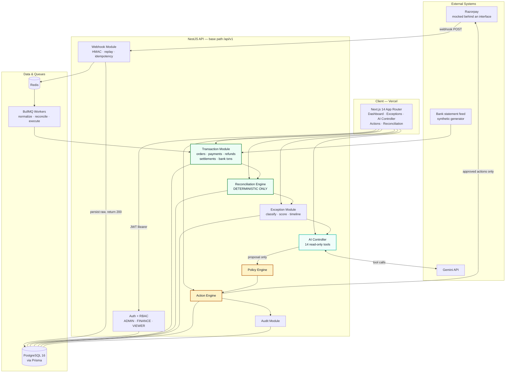
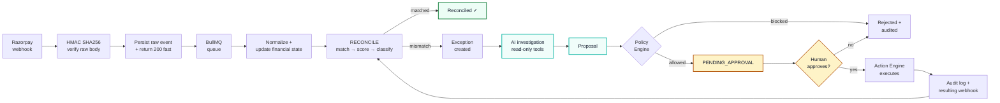

<div align="center">

# LedgerMind

**AI-powered payment reconciliation and exception resolution for Razorpay merchants.**

*Machines reconcile. AI investigates. Policies control. Humans approve.*


</div>

---

## The Problem

In a Razorpay-style payment system, one real-world transaction is scattered across **five different record types** — Orders, Payments, Refunds, Settlements, and Bank Transactions. Each is written by a different subsystem, at a different time, through asynchronous webhooks that arrive out of order, duplicate themselves, or never arrive at all.

The result is that the records **disagree**, routinely:

- A payment is marked `FAILED` by the gateway, but the bank shows the money arrived.
- A customer is charged twice; only one charge has an order behind it.
- A settlement lands ₹4,200 short of the payments it claims to cover.
- A refund was issued in the dashboard but never debited the bank.

Finding these is annoying. **Explaining** them is the real cost. A finance operator spends their day opening six tabs, cross-referencing UTRs against timestamps, and writing the same investigation note for the hundredth time. The reconciliation isn't the work — the investigation around it is.

## The Solution

LedgerMind runs a **deterministic reconciliation engine** that continuously matches records across all five sources, classifies every mismatch it cannot explain into a typed exception, and scores it by financial exposure. Then an **AI Finance Controller** investigates each exception using read-only tools, produces a confidence-scored root-cause analysis with a cited evidence trail, and *proposes* a remediation.

It never executes one. Every financial action passes through a **Policy Engine** and then a **human approver** before the Action Engine touches money. The AI has no write path to financial state — by construction, not by prompt instruction.

That split is the whole design:

| Layer | Responsibility | May mutate money? |
| --- | --- | --- |
| Reconciliation Engine | Match, score, classify — pure deterministic code | No |
| AI Controller | Investigate, explain, propose — read-only tools | **Never** |
| Policy Engine | Evaluate limits, roles, and risk on every proposal | No |
| Human Approver | Approve or reject | Authorizes |
| Action Engine | Execute the approved action, write the audit trail | Yes |

---

## Key Features

- **Deterministic reconciliation engine** — a three-level matching ladder (exact ID → UTR → amount + time proximity) with one-to-one settlement/bank matching. No AI, no floats, no heuristics in the money path.
- **Typed exception management** — ten exception types modelled, each with a deterministic dedup key so at-least-once webhook delivery can never create duplicate exceptions. Severity is scored on real financial exposure.
- **AI Finance Controller** — investigates exceptions through **14 read-only, merchant-scoped tools**, returns a root cause with a confidence score, the evidence it used, and a recommended action. Also answers natural-language questions over the merchant's own ledger.
- **Policy-controlled actions** — `REFUND`, `MARK_REVIEWED`, `ESCALATE` (and `CREATE_PAYMENT_LINK` in the full spec) run a `PROPOSED → PENDING_APPROVAL → APPROVED → EXECUTING → COMPLETED/FAILED` lifecycle. Nothing skips a state.
- **Event-driven webhook pipeline** — HMAC SHA256 verification against the *unparsed* body, raw event persisted before any processing, immediate `200`, then asynchronous handling via BullMQ with replay protection, stale-event TTL rejection, and unique-`event_id` idempotency.
- **Multi-tenant by default** — `merchantId` is derived from the JWT server-side and is never accepted from a client. Cross-tenant IDOR is closed in every service *and* in every AI tool.
- **Complete audit trail** — every state transition, AI analysis (with `prompt_version` and `tool_calls`), policy decision, approval, and execution is logged and correlated by `correlation_id`.
- **Prompt-injection resistant** — the seed data ships a deliberate injection canary inside a bank-transaction description; the AI layer is expected to ignore it.

---

## Architecture

> **Machines reconcile. AI investigates. Policies control. Humans approve.**

LedgerMind is a **NestJS modular monolith** — nine bounded modules in one deployable, with the asynchronous work pushed onto BullMQ workers. A monolith was chosen deliberately: reconciliation needs transactional reads across all five record types, and distributing that across services would buy nothing but eventual-consistency bugs.



### The core loop

Every exception in LedgerMind travels the same path, and the path always ends with a human.



Note the last edge: executing an action produces a *new* webhook, which re-enters reconciliation and auto-resolves the original exception. The loop closes itself.

📐 **Full diagram set** — matching ladder, AI tool boundary, action state machine, data model, and frontend flow — lives in **[docs/ARCHITECTURE.md](docs/ARCHITECTURE.md)**.

---

## Tech Stack

| Layer | Technology |
| --- | --- |
| Frontend | Next.js 14 (App Router), TypeScript, Tailwind CSS, shadcn/ui, Recharts, lucide-react |
| Backend | NestJS 10 (modular monolith), Prisma 5, PostgreSQL 16 |
| Async | Redis + BullMQ (normalize, reconcile, execute queues) |
| AI | Google Gemini via `@google/genai` — function calling with read-only tools |
| Auth | JWT Bearer + role-based access control (`ADMIN`, `FINANCE`, `VIEWER`) |
| Validation | Zod (frontend), `class-validator` + `class-transformer` (backend DTOs) |
| Testing | Jest (unit), Supertest (integration/E2E API), Playwright (browser) |
| Local infra | Docker Compose — PostgreSQL + Redis |
| Deployment | Vercel (frontend) · Render / Railway (API + workers) |

---

## Quick Start

### Prerequisites

- **Node.js ≥ 20** (BigInt `toJSON` patching and Next 14 both assume it)
- **Docker & Docker Compose** — for PostgreSQL and Redis
- A **Gemini API key**

### Setup

**1. Clone and enter the repo**

```bash
git clone https://github.com/<your-org>/ledgermind.git
cd ledgermind
```

**2. Configure environment**

```bash
cp .env.example backend/.env
```

Fill in the required values:

| Variable | Purpose |
| --- | --- |
| `DATABASE_URL` | PostgreSQL connection string |
| `REDIS_URL` | Redis connection string |
| `JWT_SECRET` | Signing secret for access tokens |
| `GEMINI_API_KEY` | AI Controller model access |
| `AI_MODEL` | **Must be set to `gemini-3.6-flash` for the hackathon environment.** |
| `RAZORPAY_WEBHOOK_SECRET` | HMAC SHA256 verification secret |
| `POLICY_REFUND_MAX_PAISE` | Auto-approval ceiling (policy rules live in env for the MVP) |

**3. Start infrastructure**

```bash
docker-compose up -d postgres redis
```

**4. Install dependencies**

```bash
npm install
```

**5. Migrate and seed the database**

```bash
npm run prisma:migrate     # uses `prisma migrate dev` — never `db push`
npm run seed
```

The seed creates merchants, users, orders, payments, refunds, settlements, and bank transactions across several scenarios. It deliberately **does not create any exceptions** — reconciliation must produce those live.

**6. Run the stack**

```bash
npm run start:dev
```

| Service | URL |
| --- | --- |
| Frontend (Dashboard) | http://localhost:3000/ |
| API | http://localhost:3001/api/v1 |

*Note: The frontend dashboard is mounted at the root (`/`), not at `/dashboard`.*

The API port comes from `PORT` in `backend/.env` (defaults to `3001`), and the frontend reads the API location from `NEXT_PUBLIC_API_BASE_URL`. Change one and you must change the other.

**7. Log in** with a seeded user. Use **`finance@ledgermind.dev`** / **`demo1234`** for the demo. Roles are `ADMIN` (can approve actions), `FINANCE` (can propose), and `VIEWER` (read-only).

### Injecting demo mismatches

The dashboard starts healthy. To make exceptions appear on cue, inject synthetic bank data that disagrees with the gateway records, then trigger a reconciliation run:

```bash
npm run generate:bank-data
```

Then hit **Run Reconciliation** in the UI (or `POST /api/v1/reconciliation/run`). New exceptions appear within one 3-second poll.

---

## API

Base path: **`/api/v1`**. All endpoints require a `Authorization: Bearer <jwt>` header **except** `POST /auth/login` and `POST /webhooks/razorpay`.

| Method | Endpoint | Description |
| --- | --- | --- |
| `POST` | `/auth/login` | Authenticate; returns JWT. Rate-limited to **5 requests/min** |
| `GET` | `/dashboard/metrics` | Operational KPIs — volume, reconciliation rate, open/critical exceptions, pending approvals |
| `GET` | `/transactions` | Unified view across orders, payments, refunds, settlements, bank txns |
| `GET` | `/exceptions` | List and filter exceptions (`status`, `type`, `severity`, sort, paginate) |
| `GET` | `/exceptions/:id` | Full exception detail including `analysis` |
| `GET` | `/exceptions/:id/timeline` | Event timeline, sorted by `occurred_at` (financial event time) |
| `POST` | `/exceptions/:id/investigate` | Run the AI Controller against this exception |
| `POST` | `/reconciliation/run` | Trigger a reconciliation run |
| `GET` | `/reconciliation/runs` | Run history with match/exception counts |
| `POST` | `/ai/chat` | Natural-language query over the merchant's ledger |
| `POST` | `/actions` | Propose a financial action |
| `POST` | `/actions/:id/approve` | Approve a pending action (`ADMIN` only) |
| `POST` | `/actions/:id/reject` | Reject a pending action |
| `POST` | `/webhooks/razorpay` | Razorpay event ingress — HMAC verified, idempotent |

### Three contract rules that will bite you

**1. Money is integer paise, serialized as strings.** Every monetary field is a PostgreSQL `BIGINT` and crosses the wire as a JSON **string**, because `BigInt` breaks `JSON.stringify`. Parse it with `BigInt` or integer-string math and format paise → rupees in one shared utility. **Never `parseFloat` a money field.**

```json
{ "amount": "5000000", "currency": "INR" }   // ₹50,000.00
```

**2. List endpoints are uniformly shaped**, and `limit` is capped at 100:

```json
{ "data": [ ... ], "total": 248, "page": 1, "limit": 25 }
```

**3. `merchantId` is never a request parameter.** It is derived from the JWT server-side on every single call, including inside AI tool execution. A client that sends one is either confused or attacking; the API ignores it either way.

Full request/response schemas: **[docs/07-API-SPECIFICATION.md](docs/07-API-SPECIFICATION.md)**.

---

## Project Structure

```
ledgermind/
├── backend/                    # NestJS API + BullMQ workers
│   ├── prisma/
│   │   ├── schema.prisma       # Single source of truth for the data model
│   │   ├── migrations/
│   │   └── seed.ts             # Seeds records — never exceptions
│   ├── src/
│   │   ├── auth/               # JWT, RBAC guards, login throttle
│   │   ├── webhook/            # HMAC verify, raw-body ingress, idempotency
│   │   ├── transaction/        # Orders, payments, refunds, settlements, bank
│   │   ├── reconciliation/     # Deterministic matching engine + run lifecycle
│   │   ├── exception/          # Classification, severity, dedup, timeline
│   │   ├── ai/                 # Gemini controller + 14 read-only tools
│   │   ├── policy/             # Policy Engine — evaluates every proposal
│   │   ├── action/             # Proposal → approval → execution
│   │   ├── audit/              # Correlated audit log
│   │   └── main.ts             # BigInt toJSON patch + rawBody: true
│   └── test/
├── frontend/                   # Next.js dashboard  → see frontend/README.md
│   ├── app/                    # App Router routes
│   ├── components/             # UI + shadcn layer
│   └── lib/                    # api-client, money formatting, cn()
├── docs/                       # Full design documentation (15 files)
├── scripts/
│   └── generate-bank-data.ts   # Synthetic mismatch generator for the demo
├── docker-compose.yml
└── README.md
```

Two conventions worth knowing before you edit anything: the **backend uses ES modules, so relative imports need explicit `.js` extensions**; the **frontend does not** — it uses standard Next.js/webpack resolution and the `@/` alias. And treat the API as **frozen**: the frontend adapts to the contract, not the other way around.

---

## Documentation

| Doc | What it covers |
| --- | --- |
| [01-PROBLEM.md](docs/01-PROBLEM.md) | Problem space and why reconciliation investigation is the real cost |
| [03-REQUIREMENTS.md](docs/03-REQUIREMENTS.md) | Functional and non-functional requirements |
| [04-USER-FLOWS.md](docs/04-USER-FLOWS.md) | Operator journeys end to end |
| [05-SYSTEM-ARCHITECTURE.md](docs/05-SYSTEM-ARCHITECTURE.md) | Module boundaries, queues, deployment topology |
| [06-DATABASE-SCHEMA.md](docs/06-DATABASE-SCHEMA.md) | Tables, indexes, dedup keys, denormalized `merchant_id` |
| [07-API-SPECIFICATION.md](docs/07-API-SPECIFICATION.md) | Every endpoint, request and response shape |
| [08-AI-AGENT-SPECIFICATION.md](docs/08-AI-AGENT-SPECIFICATION.md) | Tool catalogue, prompt versioning, safety boundary |
| [09-PAYMENT-STATE-MACHINE.md](docs/09-PAYMENT-STATE-MACHINE.md) | Legal payment and refund transitions |
| [10-RECONCILIATION-LOGIC.md](docs/10-RECONCILIATION-LOGIC.md) | Matching ladder, scoring, exception classification |
| [11-SECURITY.md](docs/11-SECURITY.md) | Auth, tenancy isolation, webhook verification, injection defence |
| [12-ERROR-HANDLING.md](docs/12-ERROR-HANDLING.md) | Backend error taxonomy and frontend error states (§5) |
| [13-TESTING-PLAN.md](docs/13-TESTING-PLAN.md) | Coverage strategy and critical-path tests |
| [14-BUILDATHON-DEMO.md](docs/14-BUILDATHON-DEMO.md) | The demo script, beat by beat |
| [DEMO-VIDEO-RUNBOOK.md](docs/DEMO-VIDEO-RUNBOOK.md) | Pre-flight, recording setup, and the timed 5-minute narration script |
| [15-SYSTEM-DESIGN-CONCEPTS.md](docs/15-SYSTEM-DESIGN-CONCEPTS.md) | The design principles behind the architecture |
| **[ARCHITECTURE.md](docs/ARCHITECTURE.md)** | **All flowcharts and design-flow diagrams in one place** |

---

## Testing

```bash
# Unit tests — reconciliation engine and state machines are the priority
npm run test

# Integration + E2E API tests, including tenancy isolation and IDOR
npm run test:e2e

# Browser E2E
npm run test:e2e:ui

# Type check the whole workspace
npx tsc --noEmit
```

The tests that matter most are the ones covering the **matching ladder** (a wrong match is a wrong financial conclusion), the **action state machine** (no state may be skipped), and **cross-tenant isolation** (every service and every AI tool must be merchant-scoped).

---

## The Demo, in Seven Beats

The scripted path judges will see, driven by the demo spine — a ₹50,000 payment marked `FAILED` by the gateway while the bank shows a ₹50,000 credit under `UTR-DEMO-001`:

1. **A healthy dashboard.** KPI row is green, reconciliation rate high, no open exceptions.
2. **Inject reality.** `npm run generate:bank-data` writes bank records that disagree with the gateway.
3. **Reconcile.** Trigger a run. The engine matches what it can and classifies what it can't.
4. **An exception appears.** `BANK_PAYMENT_MISMATCH`, critical severity, ₹50,000 of exposure — surfaced in *Needs Attention* within one poll.
5. **Investigate.** The AI Controller reads the order, payment, and bank transaction through read-only tools and reports the root cause with a confidence score and its evidence trail.
6. **Propose, then approve.** The AI proposes an action. The Policy Engine evaluates it. An `ADMIN` approves it — and only then does anything move.
7. **Close the loop.** The Action Engine executes, the audit trail is complete and correlated, the resulting webhook re-reconciles, and the exception resolves itself.

Full script: **[docs/14-BUILDATHON-DEMO.md](docs/14-BUILDATHON-DEMO.md)**.

---

## Design Decisions Worth Defending

**Why a deterministic engine instead of letting the AI reconcile?** Because a language model that computes a financial difference will eventually compute it wrong, and there is no way to audit that. Matching, scoring, and exposure calculation are pure code with tests. The AI never touches arithmetic.

**Why can't the AI execute anything?** The AI has read-only tools plus proposal tools. That isn't a prompt instruction the model could be talked out of — it is the shape of the tool surface. There is no code path from the AI module to Razorpay or to a financial write.

**Why integer paise everywhere?** Floating point is not closed under decimal arithmetic. `0.1 + 0.2 !== 0.3`. In reconciliation, sub-paise drift becomes a false mismatch, and a false mismatch becomes an operator's afternoon.

**Why idempotency on everything?** Webhook delivery is at-least-once, so duplicates are not an edge case, they are the normal case. `webhook_events.event_id`, `actions.idempotency_key`, and `exceptions.dedup_key` are all unique constraints — the database refuses to double-count rather than trusting the application to remember.

**Why a monolith?** Reconciliation reads across all five record types in one transaction. Splitting that into services would trade a solved consistency problem for an unsolved one.

---

## License

MIT — see [LICENSE](LICENSE).
