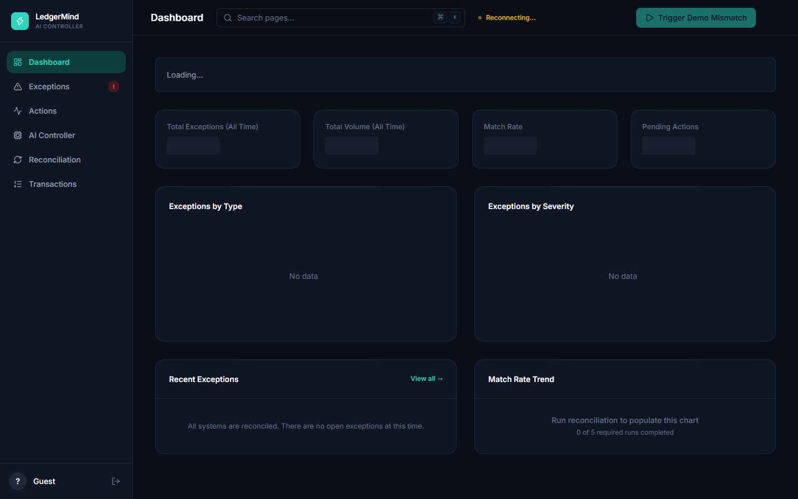
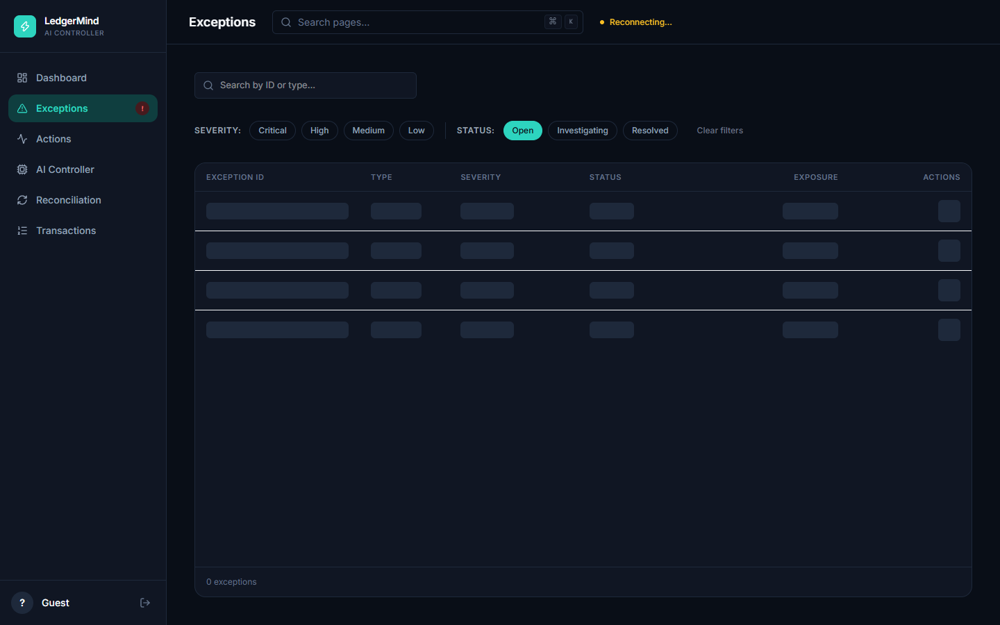
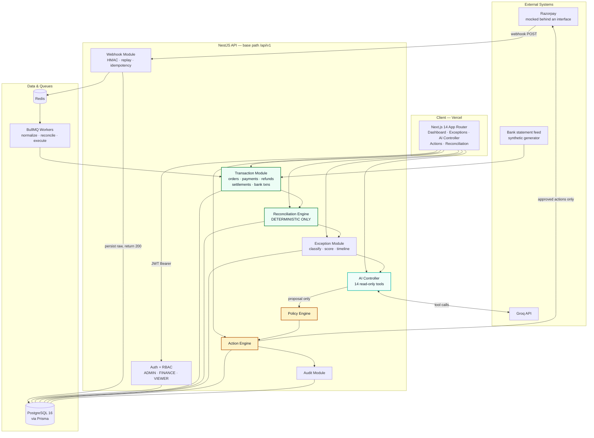
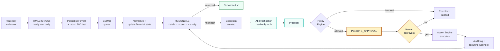

<div align="center">

# LedgerMind

**Your ledger already knows what happened. LedgerMind explains what it means.**


</div>

<div align="center">
  <picture>
    <source media="(prefers-color-scheme: dark)" srcset="docs/assets/dashboard-dark.png">
    
  </picture>
  <picture>
    <source media="(prefers-color-scheme: dark)" srcset="docs/assets/investigation-dark.png">
    
  </picture>
</div>

---

## Monday, 9:40am

Yesterday's settlement landed at 4:12 in the morning. One line on a bank statement: **₹18,42,300**.

Behind that one line sit 312 payments, 14 refunds, two chargebacks, and a partial capture someone approved on Friday afternoon. The settlement report says one number. Your dashboard says another. They are ₹4,200 apart.

Nothing is missing. Every record exists, timestamped, in the right table. And you still don't know what happened.

So you start where you always start. Open the settlement in one tab, the payments list in another, the bank statement in a third. Sort by amount. Sort by time. Find the payment that looks close. Check whether the refund on it went out before or after the cutoff. Write it down somewhere so you don't have to do it again — knowing you will do it again on Thursday.

## The problem isn't missing data

It's that there's too much of it, and almost no context around any of it.

A single real transaction in a Razorpay-style system is scattered across five record types — Orders, Payments, Refunds, Settlements, Bank Transactions — each written by a different subsystem, at a different moment, over webhooks that arrive late, arrive twice, or don't arrive. Each record is individually correct. Together they disagree.

And what you actually need from them isn't a row. It's an answer:

> Did that ₹50,000 payment really fail, or did the money arrive anyway?
>
> Was this customer charged twice, or am I looking at an authorization and its capture?
>
> Why is this settlement ₹4,200 short of the payments it claims to cover?
>
> Has Thursday's refund actually left the account, or is it still sitting somewhere?
>
> Of the forty things that look wrong this morning, which one is expensive?

None of those questions are answered by a table. Every one of them is answered by an *investigation* — and an investigation is you, six tabs, and forty minutes.

## Recording isn't understanding

This is the gap. Financial systems are excellent at recording what happened and nearly silent on what it means.

So the cost of reconciliation was never the matching. Matching is arithmetic; a computer has always been able to do it. The cost is everything that happens *after* the mismatch appears — working out which of five records is lying, deciding whether it matters, and justifying whatever you do about it to someone who will ask later.

That's the part nobody automated. Not because it's hard to compute, but because it was never a computation.

## So it explains itself

LedgerMind was built on one idea: **the ledger already contains the answer, and the work is turning it into an explanation you can act on.**

Which means the morning looks different. Matching runs continuously in the background, deterministically, in integer paise — exact IDs first, then UTR, then amount and time. What matches, matches, and you never see it. What doesn't match becomes a **typed exception**, ranked not by how recent it is but by **how much money is at risk**.

Then each exception gets investigated. Not by you — by an AI controller with fourteen read-only tools that pulls the order, the payment, the refund, the settlement, and the bank line, reads the timeline in the order the money actually moved, and comes back with a root cause, a confidence score, and the evidence it used. Every claim traceable to a record.

And when the answer is *"refund this customer ₹50,000"*, it doesn't do that. It **proposes** it. The proposal runs through a policy engine, then waits for a human being to approve it. Then it executes, logs everything, and reconciles itself closed.

So the forty things that looked wrong this morning are now one queue, sorted by what they cost you, each with an explanation attached and a recommended next step waiting for a yes.

## The transformation

<table>
<tr><th width="50%">Before</th><th width="50%">With LedgerMind</th></tr>
<tr valign="top"><td>

*"Something's off by ₹4,200 and I don't know where to start."*

Six tabs. Sort, cross-reference, guess. Forty minutes per exception, and no record of your reasoning once you've closed the tabs.

Everything looks equally urgent, so the ₹12 rounding difference gets the same attention as the ₹50,000 that never arrived.

Your reasoning lives in your head. When someone asks in March why that refund was issued, the answer is "I think we checked."

</td><td>

*"₹50,000 credited at the bank against a payment the gateway marked failed. Here's the evidence. Approve the refund?"*

The queue is sorted by money at risk. The critical item is at the top because it's expensive, not because it's new.

The investigation is already done, with its sources cited and its confidence stated.

And the reasoning is on the record — who proposed, what the analysis said, which policy applied, who approved, what was sent, what came back. Correlated by one ID, months later.

</td></tr>
</table>

That's the whole value proposition: **you stop investigating and start deciding.**

---

# How it works

Four sentences describe the entire architecture, and the order matters:

> **Machines reconcile. AI investigates. Policies control. Humans approve.**

| Layer | Responsibility | May move money? |
| --- | --- | --- |
| Reconciliation Engine | Match, score, classify — deterministic code, integer paise | No |
| AI Controller | Investigate, explain, propose — read-only tools | **Never** |
| Policy Engine | Evaluate limits, role, and exposure on every proposal | No |
| Human approver | Approve or reject | Authorizes |
| Action Engine | Execute the approved action, write the audit trail | Yes |

That table is a description of the code, not an aspiration. There is no path from the AI module to a financial write — not a forbidden path, an absent one.

## What's in the box

- **Deterministic reconciliation** — a three-level matching ladder (exact ID → UTR → amount + time proximity), one-to-one settlement/bank binding, exposure scored in real money. No model touches arithmetic.
- **Typed exceptions** — ten types modelled, each with a deterministic dedup key, so at-least-once webhook delivery can't create the same exception twice. Severity comes from financial exposure.
- **AI investigation** — 14 read-only, merchant-scoped tools. Returns root cause, confidence, evidence, and a recommended action, with `prompt_version` and `tool_calls` persisted for audit.
- **Policy-controlled actions** — `REFUND`, `MARK_REVIEWED`, `ESCALATE` moving through `PROPOSED → PENDING_APPROVAL → APPROVED → EXECUTING → COMPLETED/FAILED`. No state is skippable.
- **Event-driven ingestion** — HMAC SHA256 verified against the *unparsed* body, raw event persisted before processing, immediate `200`, then async handling on BullMQ with replay protection, stale-event TTL, and unique-`event_id` idempotency.
- **Multi-tenant by construction** — `merchantId` derived from the JWT server-side, never accepted from a client, enforced inside every service *and* every AI tool.
- **Auditable end to end** — every transition, analysis, policy decision, approval, and execution logged and joined by `correlation_id`.
- **Injection-resistant** — the seed plants an instruction-shaped string in a bank description. It's read as data, because that's what it is.

## Architecture



### One exception, start to finish

Every exception travels the same path, and the path always ends with a person.



Look at the last edge. Executing an action produces a *new* webhook, which re-enters reconciliation and resolves the original exception. The loop closes itself — nobody marks anything done by hand.

📐 **Twelve more diagrams** — matching ladder, trust boundaries, exception classification, state machines, data model, frontend flow — in **[docs/ARCHITECTURE.md](docs/ARCHITECTURE.md)**.

## Tech Stack

| Layer | Technology |
| --- | --- |
| Frontend | Next.js 14 (App Router), TypeScript, Tailwind CSS, shadcn/ui, Recharts, lucide-react |
| Backend | NestJS 10 (modular monolith), Prisma 5, PostgreSQL 16 |
| Async | Redis + BullMQ — normalize, reconcile, execute queues |
| AI | Groq API via `openai` — function calling over read-only tools |
| Auth | JWT Bearer + RBAC (`ADMIN`, `FINANCE`, `VIEWER`) |
| Validation | Zod (frontend), `class-validator` + `class-transformer` (backend DTOs) |
| Testing | Jest, Supertest, Playwright |
| Local infra | Docker Compose — PostgreSQL + Redis |
| Deployment | Vercel (frontend) · Render / Railway (API + workers) |

---

## Quick Start

### Prerequisites

**Node.js ≥ 20**, **Docker & Docker Compose**, and a **Groq API key**.

### Setup

```bash
git clone https://github.com/<your-org>/ledgermind.git
cd ledgermind
cp .env.example backend/.env
```

Fill in the required values:

| Variable | Purpose |
| --- | --- |
| `PORT` | API listen port — `3001`, leaving `3000` to the frontend |
| `DATABASE_URL` | PostgreSQL connection string |
| `REDIS_URL` | Redis connection string |
| `JWT_SECRET` | Access-token signing secret |
| `GROQ_API_KEY` | AI Controller model access |
| `RAZORPAY_WEBHOOK_SECRET` | HMAC SHA256 verification secret |
| `POLICY_REFUND_MAX_PAISE` | Refund ceiling the Policy Engine enforces |

Then bring it up:

```bash
docker-compose up -d postgres redis   # infrastructure
npm install
npm run prisma:migrate                # prisma migrate dev — never db push
npm run seed                          # records, but deliberately zero exceptions
npm run start:dev                     # API + workers + frontend
```

| Service | URL |
| --- | --- |
| Frontend | http://localhost:3000 |
| API | http://localhost:3001/api/v1 |

The API port comes from `PORT` in `backend/.env`; the frontend finds it via `NEXT_PUBLIC_API_BASE_URL`. Change one and you must change the other. Log in with a seeded user — the seed script prints the credentials. Roles are `ADMIN` (approves actions), `FINANCE` (proposes), `VIEWER` (read-only).

### Making exceptions appear

The dashboard starts clean, because the seed never creates exceptions — reconciliation has to produce them. To inject bank records that disagree with the gateway:

```bash
npm run generate:bank-data
```

Then hit **Run Reconciliation** in the UI, or `POST /api/v1/reconciliation/run`. New exceptions surface within one 3-second poll.

---

## API

Base path **`/api/v1`**. Everything requires `Authorization: Bearer <jwt>` except `POST /auth/login` and `POST /webhooks/razorpay`.

| Method | Endpoint | Description |
| --- | --- | --- |
| `POST` | `/auth/login` | Authenticate; returns JWT. Rate-limited to **5/min** |
| `GET` | `/dashboard/metrics` | Volume, reconciliation rate, open and critical exceptions, pending approvals |
| `GET` | `/transactions` | Unified view across all five record types |
| `GET` | `/exceptions` | List and filter by status, type, severity |
| `GET` | `/exceptions/:id` | Full detail, including `analysis` |
| `GET` | `/exceptions/:id/timeline` | Events sorted by `occurred_at`, not row insert time |
| `POST` | `/exceptions/:id/investigate` | Run the AI Controller against this exception |
| `POST` | `/reconciliation/run` | Trigger a reconciliation run |
| `GET` | `/reconciliation/runs` | Run history with match and exception counts |
| `POST` | `/ai/chat` | Natural-language question over your own ledger |
| `POST` | `/actions` | Propose a financial action |
| `POST` | `/actions/:id/approve` | Approve a pending action — `ADMIN` only |
| `POST` | `/actions/:id/reject` | Reject a pending action |
| `POST` | `/webhooks/razorpay` | Event ingress — HMAC verified, idempotent |

### Three contract rules that will bite you

**Money is integer paise, serialized as a string.** Every monetary field is a `BIGINT` and crosses the wire as a JSON *string*, because `BigInt` breaks `JSON.stringify`. Parse with `BigInt` or integer-string math and format paise → rupees in one shared utility. **Never `parseFloat` a money field** — floating point isn't closed under decimal arithmetic, and sub-paise drift becomes a false mismatch, which becomes somebody's afternoon.

```json
{ "amount": "5000000", "currency": "INR" }   // ₹50,000.00
```

**List responses are uniform, and `limit` caps at 100.**

```json
{ "data": [ ... ], "total": 248, "page": 1, "limit": 25 }
```

**`merchantId` is never a request parameter.** It's derived from the JWT on every call, including inside AI tool execution. A client that sends one is confused at best.

Full schemas: **[docs/07-API-SPECIFICATION.md](docs/07-API-SPECIFICATION.md)**.

---

## Project Structure

```
ledgermind/
├── backend/                    # NestJS API + BullMQ workers
│   ├── prisma/
│   │   ├── schema.prisma       # Single source of truth for the data model
│   │   ├── migrations/
│   │   └── seed.ts             # Seeds records — never exceptions
│   ├── src/
│   │   ├── auth/               # JWT, RBAC guards, login throttle
│   │   ├── webhook/            # HMAC verify, raw-body ingress, idempotency
│   │   ├── transaction/        # Orders, payments, refunds, settlements, bank
│   │   ├── reconciliation/     # Deterministic matching engine + run lifecycle
│   │   ├── exception/          # Classification, severity, dedup, timeline
│   │   ├── ai/                 # Groq controller + 14 read-only tools
│   │   ├── policy/             # Evaluates every proposal
│   │   ├── action/             # Proposal → approval → execution
│   │   ├── audit/              # Correlated audit log
│   │   └── main.ts             # BigInt toJSON patch + rawBody: true
│   └── test/
├── frontend/                   # Next.js dashboard → see frontend/README.md
│   ├── app/                    # App Router routes
│   ├── components/             # UI + shadcn layer
│   └── lib/                    # api-client, money formatting, cn()
├── docs/                       # Design documentation
├── scripts/
│   └── generate-bank-data.ts   # Synthetic mismatch generator
├── docker-compose.yml
└── README.md
```

Two conventions to know before editing: the **backend is ES modules, so relative imports need explicit `.js` extensions**; the **frontend doesn't** — standard Next.js resolution with the `@/` alias. And treat the API as **frozen** — the frontend adapts to the contract, never the reverse.

---

## Documentation

| Doc | What it covers |
| --- | --- |
| [01-PROBLEM.md](docs/01-PROBLEM.md) | Why reconciliation *investigation* is the real cost |
| [03-REQUIREMENTS.md](docs/03-REQUIREMENTS.md) | Functional and non-functional requirements |
| [04-USER-FLOWS.md](docs/04-USER-FLOWS.md) | Operator journeys end to end |
| [05-SYSTEM-ARCHITECTURE.md](docs/05-SYSTEM-ARCHITECTURE.md) | Module boundaries, queues, deployment topology |
| [06-DATABASE-SCHEMA.md](docs/06-DATABASE-SCHEMA.md) | Tables, indexes, dedup keys, denormalized `merchant_id` |
| [07-API-SPECIFICATION.md](docs/07-API-SPECIFICATION.md) | Every endpoint, request and response shape |
| [08-AI-AGENT-SPECIFICATION.md](docs/08-AI-AGENT-SPECIFICATION.md) | Tool catalogue, prompt versioning, safety boundary |
| [09-PAYMENT-STATE-MACHINE.md](docs/09-PAYMENT-STATE-MACHINE.md) | Legal payment and refund transitions |
| [10-RECONCILIATION-LOGIC.md](docs/10-RECONCILIATION-LOGIC.md) | Matching ladder, scoring, classification |
| [11-SECURITY.md](docs/11-SECURITY.md) | Auth, tenancy isolation, webhook verification, injection defence |
| [12-ERROR-HANDLING.md](docs/12-ERROR-HANDLING.md) | Backend error taxonomy, frontend error states (§5) |
| [13-TESTING-PLAN.md](docs/13-TESTING-PLAN.md) | Coverage strategy and critical-path tests |
| [14-BUILDATHON-DEMO.md](docs/14-BUILDATHON-DEMO.md) | The demo script, beat by beat |
| [15-SYSTEM-DESIGN-CONCEPTS.md](docs/15-SYSTEM-DESIGN-CONCEPTS.md) | Design principles behind the architecture |
| **[ARCHITECTURE.md](docs/ARCHITECTURE.md)** | **All flowcharts and design-flow diagrams** |
| **[DEMO-VIDEO-RUNBOOK.md](docs/DEMO-VIDEO-RUNBOOK.md)** | **Pre-flight, recording setup, timed narration script** |

---

## Testing

```bash
npm run test        # Jest unit — matching ladder and state machines first
npm run test:e2e    # Supertest — auth, RBAC, tenancy isolation, IDOR
npm run test:e2e:ui # Playwright
npx tsc --noEmit    # must stay clean
```

Three suites carry the weight. The **matching ladder**, because a wrong match is a wrong financial conclusion delivered with confidence. The **action state machine**, because a skippable state is money moving without approval. And **cross-tenant isolation**, because every service and every AI tool has to be merchant-scoped, and one that isn't is a data breach rather than a bug.

---

## See it in five beats

The scripted path, driven by the demo spine — a **₹50,000 payment the gateway marked `FAILED`** while the bank shows a **₹50,000 credit under `UTR-DEMO-001`**:

1. **A clean queue.** KPI row green, nothing needing attention. This is what reconciled looks like.
2. **Reality arrives.** `npm run generate:bank-data` writes bank records that disagree with the gateway, then a reconciliation run sorts what it can and classifies what it can't.
3. **One exception, at the top.** `BANK_PAYMENT_MISMATCH`, critical, ₹50,000 of exposure — first because it's expensive, not because it's new.
4. **The investigation is already done.** Root cause, confidence, and every record it read. Including the bank description with an instruction-shaped string in it, which it correctly treated as text.
5. **Someone says yes.** Policy evaluates, an `ADMIN` approves, the action executes, the audit trail closes, and the resulting webhook reconciles the exception away.

Full script: **[docs/14-BUILDATHON-DEMO.md](docs/14-BUILDATHON-DEMO.md)** · Recording it: **[docs/DEMO-VIDEO-RUNBOOK.md](docs/DEMO-VIDEO-RUNBOOK.md)**

---

## Decisions worth defending

**Why not let the AI reconcile?** A language model that computes a financial difference will eventually compute one wrong, and there'd be no way to audit it. Matching, scoring, and exposure are pure code with tests. The model never does arithmetic on money.

**Why can't the AI execute anything?** It has read-only tools and one place it can write — a proposal. That isn't a prompt instruction it could be talked out of; it's the shape of the tool surface. No code path exists from the AI module to a financial write.

**Why integer paise everywhere?** Because `0.1 + 0.2 !== 0.3`, and in reconciliation that rounding error is indistinguishable from a real mismatch.

**Why idempotency on everything?** Webhook delivery is at-least-once, so duplicates are the normal case, not the edge case. `webhook_events.event_id`, `actions.idempotency_key`, and `exceptions.dedup_key` are unique constraints — the database refuses to double-count rather than trusting the application to remember.

**Why a monolith?** Reconciliation reads across all five record types in one transaction. Splitting that into services would trade a solved consistency problem for an unsolved one.

---

## Why this matters

Financial systems already generate more than enough noise. Every integration adds another feed, every feed adds another version of the truth, and the person in the middle is left assembling meaning by hand from records that were never designed to explain themselves.

The point isn't to remove that person. It's to stop spending them on work a machine can do — the cross-referencing, the tab-juggling, the fourth investigation of the same pattern this week — and leave them the part that actually needs judgment: deciding what to do about the money.

**Machines reconcile. AI investigates. Policies control. Humans approve.**

---

## License

MIT — see [LICENSE](LICENSE).
