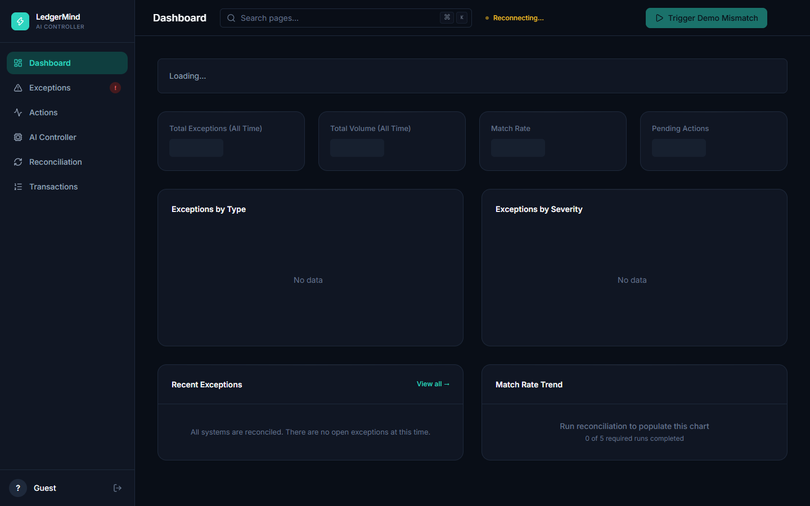
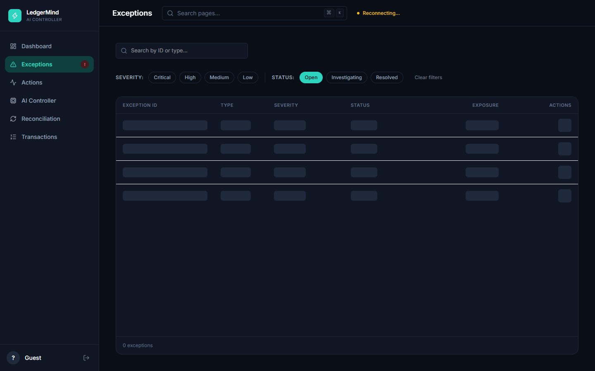
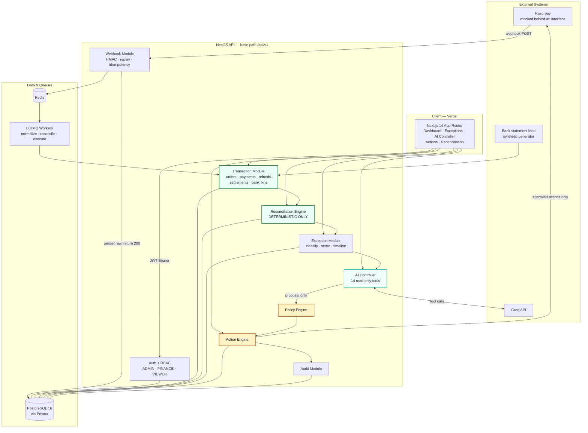
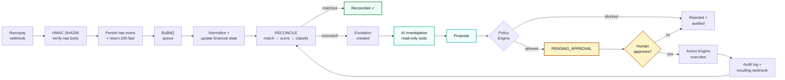

<div align="center">

# LedgerMind

**Your ledger already knows what happened. LedgerMind explains what it means.**


</div>

<div align="center">
  <picture>
    <source media="(prefers-color-scheme: dark)" srcset="docs/assets/dashboard-dark.png">
    
  </picture>
  <picture>
    <source media="(prefers-color-scheme: dark)" srcset="docs/assets/investigation-dark.png">
    
  </picture>
</div>

---

## Monday, 9:40am

Yesterday's settlement landed at 4:12 in the morning. One line on a bank statement: **₹18,42,300**.

Behind that one line sit 312 payments, 14 refunds, two chargebacks, and a partial capture someone approved on Friday afternoon. The settlement report says one number. Your dashboard says another. They are ₹4,200 apart.

Nothing is missing. Every record exists, timestamped, in the right table. And you still don't know what happened.

So you start where you always start. Open the settlement in one tab, the payments list in another, the bank statement in a third. Sort by amount. Sort by time. Find the payment that looks close. Check whether the refund on it went out before or after the cutoff. Write it down somewhere so you don't have to do it again — knowing you will do it again on Thursday.

## The problem isn't missing data

It's that there's too much of it, and almost no context around any of it.

A single real transaction in a Razorpay-style system is scattered across five record types — Orders, Payments, Refunds, Settlements, Bank Transactions — each written by a different subsystem, at a different moment, over webhooks that arrive late, arrive twice, or don't arrive. Each record is individually correct. Together they disagree.

And what you actually need from them isn't a row. It's an answer:

> Did that ₹50,000 payment really fail, or did the money arrive anyway?
>
> Was this customer charged twice, or am I looking at an authorization and its capture?
>
> Why is this settlement ₹4,200 short of the payments it claims to cover?
>
> Has Thursday's refund actually left the account, or is it still sitting somewhere?
>
> Of the forty things that look wrong this morning, which one is expensive?

None of those questions are answered by a table. Every one of them is answered by an *investigation* — and an investigation is you, six tabs, and forty minutes.

## Recording isn't understanding

This is the gap. Financial systems are excellent at recording what happened and nearly silent on what it means.

So the cost of reconciliation was never the matching. Matching is arithmetic; a computer has always been able to do it. The cost is everything that happens *after* the mismatch appears — working out which of five records is lying, deciding whether it matters, and justifying whatever you do about it to someone who will ask later.

That's the part nobody automated. Not because it's hard to compute, but because it was never a computation.

## So it explains itself

LedgerMind was built on one idea: **the ledger already contains the answer, and the work is turning it into an explanation you can act on.**

Which means the morning looks different. Matching runs continuously in the background, deterministically, in integer paise — exact IDs first, then UTR, then amount and time. What matches, matches, and you never see it. What doesn't match becomes a **typed exception**, ranked not by how recent it is but by **how much money is at risk**.

Then each exception gets investigated. Not by you — by an AI controller with fourteen read-only tools that pulls the order, the payment, the refund, the settlement, and the bank line, reads the timeline in the order the money actually moved, and comes back with a root cause, a confidence score, and the evidence it used. Every claim traceable to a record.

And when the answer is *"refund this customer ₹50,000"*, it doesn't do that. It **proposes** it. The proposal runs through a policy engine, then waits for a human being to approve it. Then it executes, logs everything, and reconciles itself closed.

So the forty things that looked wrong this morning are now one queue, sorted by what they cost you, each with an explanation attached and a recommended next step waiting for a yes.

## The transformation

<table>
<tr><th width="50%">Before</th><th width="50%">With LedgerMind</th></tr>
<tr valign="top"><td>

*"Something's off by ₹4,200 and I don't know where to start."*

Six tabs. Sort, cross-reference, guess. Forty minutes per exception, and no record of your reasoning once you've closed the tabs.

Everything looks equally urgent, so the ₹12 rounding difference gets the same attention as the ₹50,000 that never arrived.

Your reasoning lives in your head. When someone asks in March why that refund was issued, the answer is "I think we checked."

</td><td>

*"₹50,000 credited at the bank against a payment the gateway marked failed. Here's the evidence. Approve the refund?"*

The queue is sorted by money at risk. The critical item is at the top because it's expensive, not because it's new.

The investigation is already done, with its sources cited and its confidence stated.

And the reasoning is on the record — who proposed, what the analysis said, which policy applied, who approved, what was sent, what came back. Correlated by one ID, months later.

</td></tr>
</table>

That's the whole value proposition: **you stop investigating and start deciding.**

---

# How it works

Four sentences describe the entire architecture, and the order matters:

> **Machines reconcile. AI investigates. Policies control. Humans approve.**

| Layer | Responsibility | May move money? |
| --- | --- | --- |
| Reconciliation Engine | Match, score, classify — deterministic code, integer paise | No |
| AI Controller | Investigate, explain, propose — read-only tools | **Never** |
| Policy Engine | Evaluate limits, role, and exposure on every proposal | No |
| Human approver | Approve or reject | Authorizes |
| Action Engine | Execute the approved action, write the audit trail | Yes |

That table is a description of the code, not an aspiration. There is no path from the AI module to a financial write — not a forbidden path, an absent one.

## What's in the box

- **Deterministic reconciliation** — a three-level matching ladder (exact ID → UTR → amount + time proximity), one-to-one settlement/bank binding, exposure scored in real money. No model touches arithmetic.
- **Typed exceptions** — ten types modelled, each with a deterministic dedup key, so at-least-once webhook delivery can't create the same exception twice. Severity comes from financial exposure.
- **AI investigation** — 14 read-only, merchant-scoped tools. Returns root cause, confidence, evidence, and a recommended action, with `prompt_version` and `tool_calls` persisted for audit.
- **Policy-controlled actions** — `REFUND`, `MARK_REVIEWED`, `ESCALATE` moving through `PROPOSED → PENDING_APPROVAL → APPROVED → EXECUTING → COMPLETED/FAILED`. No state is skippable.
- **Event-driven ingestion** — HMAC SHA256 verified against the *unparsed* body, raw event persisted before processing, immediate `200`, then async handling on BullMQ with replay protection, stale-event TTL, and unique-`event_id` idempotency.
- **Multi-tenant by construction** — `merchantId` derived from the JWT server-side, never accepted from a client, enforced inside every service *and* every AI tool.
- **Auditable end to end** — every transition, analysis, policy decision, approval, and execution logged and joined by `correlation_id`.
- **Injection-resistant** — the seed plants an instruction-shaped string in a bank description. It's read as data, because that's what it is.

## Architecture


```mermaid
flowchart TB
    subgraph ext["External Systems"]
        RZP["Razorpay<br/>mocked behind an interface"]
        BANKFEED["Bank statement feed<br/>synthetic generator"]
        LLM["Groq API"]
    end

    subgraph client["Client — Vercel"]
        WEB["Next.js 14 App Router<br/>Dashboard · Exceptions · AI Controller<br/>Actions · Reconciliation"]
    end

    subgraph apiL["NestJS API — base path /api/v1"]
        direction TB
        AUTH["Auth + RBAC<br/>ADMIN · FINANCE · VIEWER"]
        WH["Webhook Module<br/>HMAC · replay · idempotency"]
        TXN["Transaction Module<br/>orders · payments · refunds<br/>settlements · bank txns"]
        RECON["Reconciliation Engine<br/>DETERMINISTIC ONLY"]
        EXC["Exception Module<br/>classify · score · timeline"]
        AI["AI Controller<br/>14 read-only tools"]
        POL["Policy Engine"]
        ACT["Action Engine"]
        AUD["Audit Module"]
    end

    subgraph data["Data & Queues"]
        PG[("PostgreSQL 16<br/>via Prisma")]
        REDIS[("Redis")]
        WORKER["BullMQ Workers<br/>normalize · reconcile · execute"]
    end

    WEB -->|"JWT Bearer"| AUTH
    WEB --> TXN
    WEB --> EXC
    WEB --> AI
    WEB --> ACT
    WEB --> RECON

    RZP -->|"webhook POST"| WH
    BANKFEED --> TXN
    AI <-->|"tool calls"| LLM

    WH -->|"persist raw, return 200"| PG
    WH --> REDIS
    REDIS --> WORKER
    WORKER --> TXN
    TXN --> RECON
    RECON --> EXC
    EXC --> AI
    AI -->|"proposal only"| POL
    POL --> ACT
    ACT -->|"approved actions only"| RZP
    ACT --> AUD

    AUTH --- PG
    TXN --- PG
    RECON --- PG
    EXC --- PG
    ACT --- PG
    AUD --- PG

    classDef det fill:#ECFDF5,stroke:#15803D,stroke-width:2px,color:#0F172A
    classDef ai fill:#F0FDFA,stroke:#14B8A6,stroke-width:2px,color:#0F172A
    classDef gate fill:#FEF3C7,stroke:#B45309,stroke-width:2px,color:#0F172A
    class RECON,TXN det
    class AI ai
    class POL,ACT gate
```

### One exception, start to finish

Every exception travels the same path, and the path always ends with a person.


```mermaid
flowchart LR
    A["Razorpay<br/>webhook"] --> B["HMAC SHA256<br/>verify raw body"]
    B --> C["Persist raw event<br/>+ return 200 fast"]
    C --> D["BullMQ<br/>queue"]
    D --> E["Normalize +<br/>update financial state"]
    E --> F["RECONCILE<br/>match → score → classify"]
    F -->|"matched"| G["Reconciled ✓"]
    F -->|"mismatch"| H["Exception<br/>created"]
    H --> I["AI investigation<br/>read-only tools"]
    I --> J["Proposal"]
    J --> K{"Policy<br/>Engine"}
    K -->|"blocked"| L["Rejected +<br/>audited"]
    K -->|"allowed"| M["PENDING_APPROVAL"]
    M --> N{"Human<br/>approves?"}
    N -->|"no"| L
    N -->|"yes"| O["Action Engine<br/>executes"]
    O --> P["Audit log +<br/>resulting webhook"]
    P --> F

    classDef human fill:#FEF3C7,stroke:#B45309,stroke-width:2px,color:#0F172A
    classDef ok fill:#ECFDF5,stroke:#15803D,stroke-width:2px,color:#0F172A
    classDef aic fill:#F0FDFA,stroke:#14B8A6,stroke-width:2px,color:#0F172A
    class N,M human
    class G ok
    class I,J aic
```

Look at the last edge. Executing an action produces a *new* webhook, which re-enters reconciliation and resolves the original exception. The loop closes itself — nobody marks anything done by hand.

📐 **Twelve more diagrams** — matching ladder, trust boundaries, exception classification, state machines, data model, frontend flow — in **[docs/architecture/diagrams.md](docs/architecture/diagrams.md)**.

## Tech Stack

| Layer | Technology |
| --- | --- |
| Frontend | Next.js 16 (App Router + Turbopack), React 19, TypeScript, Tailwind CSS, Lucide, Recharts |
| Backend | NestJS 12 (modular monolith), Prisma 5, PostgreSQL 16 |
| Async | Redis 7 + BullMQ — normalize, reconcile, and event worker queues |
| AI | Groq API (`llama-3.3-70b-versatile`) via OpenAI SDK — function calling over read-only tools |
| Auth | Multi-tenant JWT Bearer + RBAC (`ADMIN`, `FINANCE`, `VIEWER`) |
| Validation | Zod, `class-validator` + `class-transformer` (strict NestJS DTO validation) |
| Testing | Jest, Supertest, Playwright |
| Containers | Docker Compose — multi-stage non-root containers (`postgres`, `redis`, `backend`, `frontend`) |
| Deployment | Vercel (frontend) · Render / Railway (API + workers) |

---

## Quick Start

### Prerequisites

**Node.js ≥ 20**, **Docker & Docker Compose**, and a **Groq API key**.

### Setup

```bash
git clone https://github.com/<your-org>/ledgermind.git
cd ledgermind
cp .env.example backend/.env
```

Fill in the required values:

| Variable | Purpose |
| --- | --- |
| `PORT` | API listen port — `3001`, leaving `3000` to the frontend |
| `DATABASE_URL` | PostgreSQL connection string |
| `REDIS_URL` | Redis connection string |
| `JWT_SECRET` | Access-token signing secret |
| `GROQ_API_KEY` | AI Controller model access |
| `RAZORPAY_WEBHOOK_SECRET` | HMAC SHA256 verification secret |
| `POLICY_REFUND_MAX_PAISE` | Refund ceiling the Policy Engine enforces |

### Option A — 1-Command Docker Compose (Recommended)

Run the full stack (Postgres 16, Redis 7, NestJS API + Queue Workers, Next.js Frontend):

```bash
docker compose up --build
```

This automatically:
1. Provisions PostgreSQL and Redis with health checks.
2. Synchronizes Prisma schema and seeds demo credentials.
3. Serves the NestJS API with Swagger docs at `http://localhost:3001/api`.
4. Serves the optimized Next.js frontend at `http://localhost:3000`.

### Option B — Local Development

```bash
docker compose up -d postgres redis   # launch database & redis
npm run dev:backend                   # in terminal 1 (starts NestJS on :3001)
npm run dev:frontend                  # in terminal 2 (starts Next.js on :3000)
```

| Service | URL |
| --- | --- |
| Frontend | http://localhost:3000 |
| API | http://localhost:3001/api/v1 |
| Swagger Docs | http://localhost:3001/api |

Log in with seeded demo users:
- **Admin**: `admin@ledgermind.dev` / `demo1234`
- **Finance**: `finance@ledgermind.dev` / `demo1234`
- **Viewer**: `viewer@ledgermind.dev` / `demo1234`

### Making exceptions appear

The dashboard starts clean, because the seed never creates exceptions — reconciliation has to produce them. To inject bank records that disagree with the gateway:

```bash
npm run generate:bank-data
```

Then hit **Run Reconciliation** in the UI, or `POST /api/v1/reconciliation/run`. New exceptions surface within one 3-second poll.

---

## API

Base path **`/api/v1`**. Everything requires `Authorization: Bearer <jwt>` except `POST /auth/login` and `POST /webhooks/razorpay`.

| Method | Endpoint | Description |
| --- | --- | --- |
| `POST` | `/auth/login` | Authenticate; returns JWT. Rate-limited to **5/min** |
| `GET` | `/dashboard/metrics` | Volume, reconciliation rate, open and critical exceptions, pending approvals |
| `GET` | `/transactions` | Unified view across all five record types |
| `GET` | `/payments` · `/settlements` | Paginated lists with search, status, method, and date filters |
| `GET` | `/payments/:id` · `/settlements/:id` | One record with its linked order and refunds, or bank transactions |
| `GET` | `/exceptions` | List and filter by status, type, severity |
| `GET` | `/exceptions/:id` | Full detail, including `analysis` |
| `GET` | `/exceptions/:id/timeline` | Events sorted by `occurred_at`, not row insert time |
| `POST` | `/exceptions/:id/investigate` | Run the AI Controller against this exception |
| `POST` | `/reconciliation/run` | Trigger a reconciliation run |
| `GET` | `/reconciliation/runs` | Run history with match and exception counts |
| `POST` | `/ai/chat` | Natural-language question over your own ledger |
| `POST` | `/actions` | Propose a financial action |
| `POST` | `/actions/:id/approve` | Approve a pending action — `ADMIN` only |
| `POST` | `/actions/:id/reject` | Reject a pending action |
| `POST` | `/webhooks/razorpay` | Event ingress — HMAC verified, idempotent |

### Three contract rules that will bite you

**Money is integer paise, serialized as a string.** Every monetary field is a `BIGINT` and crosses the wire as a JSON *string*, because `BigInt` breaks `JSON.stringify`. Parse with `BigInt` or integer-string math and format paise → rupees in one shared utility. **Never `parseFloat` a money field** — floating point isn't closed under decimal arithmetic, and sub-paise drift becomes a false mismatch, which becomes somebody's afternoon.

```json
{ "amount": "5000000", "currency": "INR" }   // ₹50,000.00
```

**List responses are uniform, and `limit` caps at 100.**

```json
{ "data": [ ... ], "total": 248, "page": 1, "limit": 25 }
```

**`merchantId` is never a request parameter.** It's derived from the JWT on every call, including inside AI tool execution. A client that sends one is confused at best.

Full schemas: **[docs/specifications/api.md](docs/specifications/api.md)**.

---

## Project Structure

```
ledgermind/
├── backend/                    # NestJS API + BullMQ workers
│   ├── prisma/
│   │   ├── schema.prisma       # Single source of truth for the data model
│   │   └── seed.ts             # Deterministic development seed
│   ├── src/
│   │   ├── auth/               # JWT, RBAC guards, login throttle
│   │   ├── webhook/            # HMAC verify, raw-body ingress, idempotency
│   │   ├── transaction/        # Orders, payments, refunds, settlements, bank
│   │   ├── reconciliation/     # Deterministic matching engine + run lifecycle
│   │   ├── exception/          # Classification, severity, dedup, timeline
│   │   ├── ai/                 # Groq controller + 14 read-only tools
│   │   ├── policy/             # Evaluates every proposal
│   │   ├── action/             # Proposal → approval → execution
│   │   ├── audit/              # Correlated audit log
│   │   └── main.ts             # BigInt serialization + security configuration
│   └── test/
├── frontend/                   # Next.js dashboard
│   ├── app/                    # App Router routes
│   ├── components/             # UI component library
│   └── lib/                    # api-client, money formatting, tokens
├── docs/                       # Structured design & architecture documentation
│   ├── architecture/           # Overview, diagrams, reconciliation, state machines
│   ├── specifications/         # API, database, AI agent, security
│   ├── product/                # Problem statement, PRD, requirements, user flows
│   └── operations/             # Testing plan, error handling, Groq setup
├── docker-compose.yml
└── README.md
```

Two conventions to know before editing: the **backend is ES modules, so relative imports need explicit `.js` extensions**; the **frontend doesn't** — standard Next.js resolution with the `@/` alias. And treat the API as **frozen** — the frontend adapts to the contract, never the reverse.

---

## Documentation

Full documentation index available at **[docs/README.md](docs/README.md)**.

### Architecture
- **[System Architecture](docs/architecture/overview.md)** — Module boundaries, queues, deployment topology.
- **[Architecture Diagrams](docs/architecture/diagrams.md)** — Matching ladder, trust boundaries, state machines, and data models.
- **[Reconciliation Engine](docs/architecture/reconciliation.md)** — Matching ladder, scoring, and classification.
- **[Payment State Machine](docs/architecture/state-machines.md)** — Legal payment and refund state transitions.
- **[Design Concepts](docs/architecture/design-concepts.md)** — Design principles, financial invariants, and fault tolerance.

### Specifications
- **[API Specification](docs/specifications/api.md)** — Endpoints, request and response schemas.
- **[Database Schema](docs/specifications/database.md)** — Tables, indexes, dedup keys, denormalized tenant models.
- **[AI Agent Specification](docs/specifications/ai-agent.md)** — Tool catalogue, prompt versioning, safety boundaries.
- **[Security & Multi-Tenancy](docs/specifications/security.md)** — Auth, tenancy isolation, webhook verification, injection defense.

### Product & Operations
- **[Problem Statement](docs/product/problem.md)** — Why reconciliation investigation is the real operational cost.
- **[Product Requirements (PRD)](docs/product/prd.md)** — Features, persona definitions, and metrics.
- **[Requirements Matrix](docs/product/requirements.md)** — Functional and non-functional requirements.
- **[User Flows](docs/product/user-flows.md)** — Operator journeys end to end.
- **[Testing & QA Plan](docs/operations/testing.md)** — Coverage strategy and critical-path tests.
- **[Error Handling Taxonomy](docs/operations/error-handling.md)** — Backend error taxonomy and frontend error states.
- **[Groq AI Setup](docs/operations/groq-setup.md)** — Model configuration and verification runbook.

---

## Testing

```bash
npm run test        # Jest unit — matching ladder and state machines first
npm run test:e2e    # Supertest — auth, RBAC, tenancy isolation, IDOR
npm run test:e2e:ui # Playwright
npx tsc --noEmit    # must stay clean
```

Three suites carry the weight. The **matching ladder**, because a wrong match is a wrong financial conclusion delivered with confidence. The **action state machine**, because a skippable state is money moving without approval. And **cross-tenant isolation**, because every service and every AI tool has to be merchant-scoped, and one that isn't is a data breach rather than a bug.

---

## End-to-End Operational Lifecycle

The operational lifecycle resolves state discrepancies — for example, a **₹50,000 payment marked `FAILED` by the gateway** while the bank statement records a **₹50,000 credit**:

1. **Deterministic Ingestion & Matching.** Ledger records are ingested across internal orders, gateway transactions, and bank statements. The reconciliation engine runs matching algorithms and categorizes balance exceptions.
2. **Discrepancy Identification.** A `BANK_PAYMENT_MISMATCH` is flagged with severity and financial exposure calculated from minor-unit amounts.
3. **AI Investigation.** The AI Controller gathers evidence via read-only tools, reviews transaction event histories, and synthesizes root causes without mutating financial state.
4. **Governed Human Approval.** Proposed resolutions (such as payment links or refunds) are evaluated by the deterministic Policy Engine and queued for mandatory human approval.
5. **Execution & Audit Closure.** Upon authorized sign-off, the action is executed with full cryptographic audit logging and status synchronization.

---

## Decisions worth defending

**Why not let the AI reconcile?** A language model that computes a financial difference will eventually compute one wrong, and there'd be no way to audit it. Matching, scoring, and exposure are pure code with tests. The model never does arithmetic on money.

**Why can't the AI execute anything?** It has read-only tools and one place it can write — a proposal. That isn't a prompt instruction it could be talked out of; it's the shape of the tool surface. No code path exists from the AI module to a financial write.

**Why integer paise everywhere?** Because `0.1 + 0.2 !== 0.3`, and in reconciliation that rounding error is indistinguishable from a real mismatch.

**Why idempotency on everything?** Webhook delivery is at-least-once, so duplicates are the normal case, not the edge case. `webhook_events.event_id`, `actions.idempotency_key`, and `exceptions.dedup_key` are unique constraints — the database refuses to double-count rather than trusting the application to remember.

**Why a monolith?** Reconciliation reads across all five record types in one transaction. Splitting that into services would trade a solved consistency problem for an unsolved one.

---

## Why this matters

Financial systems already generate more than enough noise. Every integration adds another feed, every feed adds another version of the truth, and the person in the middle is left assembling meaning by hand from records that were never designed to explain themselves.

The point isn't to remove that person. It's to stop spending them on work a machine can do — the cross-referencing, the tab-juggling, the fourth investigation of the same pattern this week — and leave them the part that actually needs judgment: deciding what to do about the money.

**Machines reconcile. AI investigates. Policies control. Humans approve.**

---

## License

MIT — see [LICENSE](LICENSE).
