# LedgerMind — Architecture & Design Flow

Every diagram in this document renders natively on GitHub. Read them in order: the first three establish *what the system is*, the middle four establish *how a transaction becomes a resolved exception*, and the last three cover the data model, the UI flow, and the trust boundaries.

**Contents**

1. [System Architecture](#1-system-architecture)
2. [Module Dependency Graph](#2-module-dependency-graph)
3. [Trust Boundaries & the AI Safety Line](#3-trust-boundaries--the-ai-safety-line)
4. [Webhook Ingestion Sequence](#4-webhook-ingestion-sequence)
5. [The Reconciliation Matching Ladder](#5-the-reconciliation-matching-ladder)
6. [Exception Classification](#6-exception-classification)
7. [AI Investigation → Policy → Approval → Execution](#7-ai-investigation--policy--approval--execution)
8. [Action Lifecycle State Machine](#8-action-lifecycle-state-machine)
9. [Payment State Machine](#9-payment-state-machine)
10. [Data Model](#10-data-model)
11. [Frontend Design Flow](#11-frontend-design-flow)
12. [Design System Reference](#12-design-system-reference)

---

## 1. System Architecture

A NestJS modular monolith with asynchronous work on BullMQ, a PostgreSQL system of record, and a Next.js client. Green is deterministic code, teal is the AI layer, amber is a control gate that a human or a policy must pass.

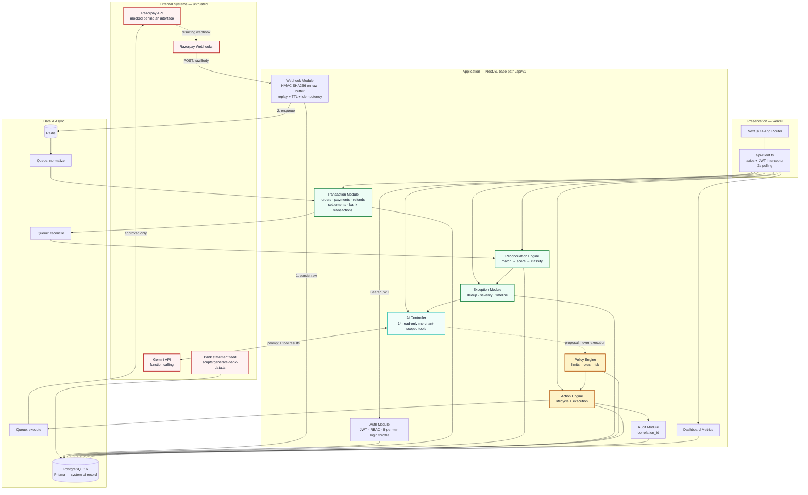

---

## 2. Module Dependency Graph

Nine modules, and the arrows only point one way through the money path. Nothing downstream of the Policy Engine can be reached from the AI module.

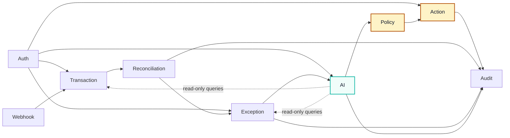

---

## 3. Trust Boundaries & the AI Safety Line

This is the diagram to point at when someone asks "what stops the AI from issuing a refund?" The answer is that there is no edge from the AI zone to the execution zone. Not a disallowed edge — an absent one.

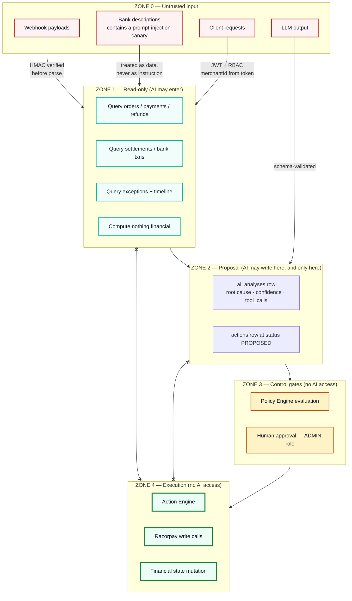

---

## 4. Webhook Ingestion Sequence

The ordering here is deliberate and not negotiable: verify on the **unparsed buffer**, persist the raw event **before** any processing, return `200` **before** doing work. If the worker crashes, the event is already durable and replayable.

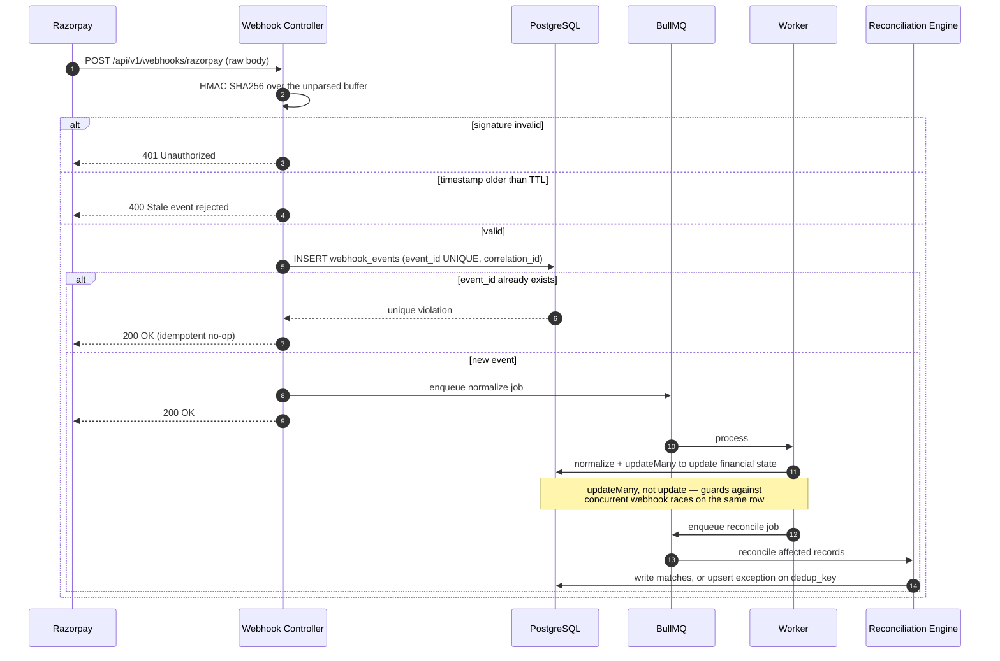

---

## 5. The Reconciliation Matching Ladder

Three levels, tried in order, most-certain first. The buildathon build stops at level 3 — fuzzy metadata matching was cut. Every level is pure integer arithmetic on paise.

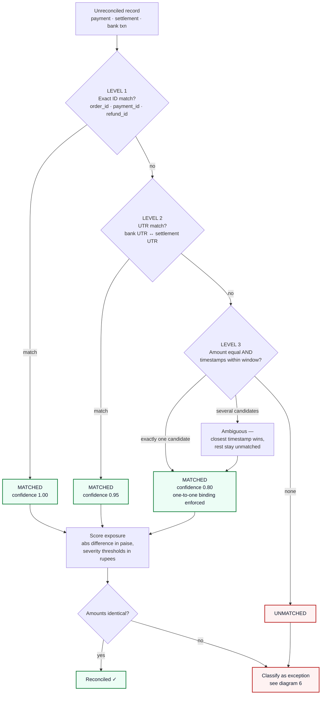

> **Two bugs already fixed here, don't reintroduce them:** severity thresholds compare **rupees**, not paise (a ₹100 threshold against a paise value fires on everything); and settlement/bank matching is **one-to-one with time proximity**, so a single bank credit cannot satisfy three settlements at once.

---

## 6. Exception Classification

Ten types are modelled in the schema. Four detectors are active in the buildathon build — marked ✅ below — chosen because they carry the demo and cover the highest-frequency real-world mismatches.

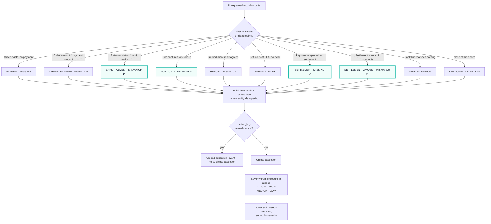

---

## 7. AI Investigation → Policy → Approval → Execution

The critical read of this diagram: the AI's last act is writing a **proposal row**. Everything after that happens in modules the AI cannot call.

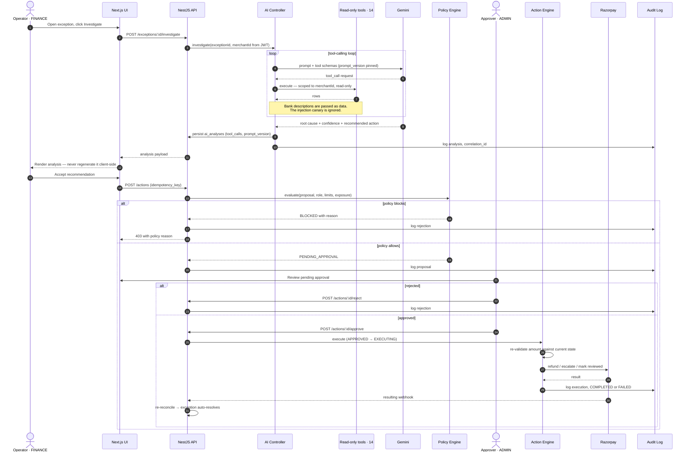

---

## 8. Action Lifecycle State Machine

No state is skippable. The `idempotency_key` unique constraint means a retried proposal cannot become a second action.

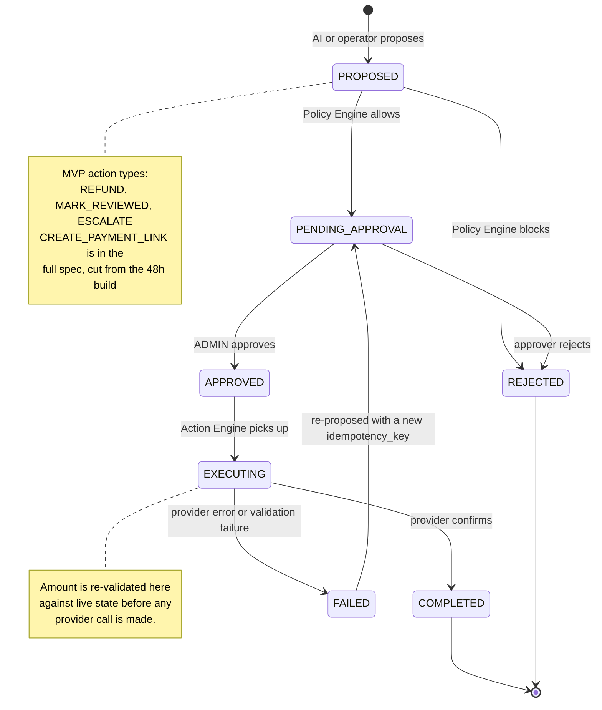

---

## 9. Payment State Machine

The gateway's view of a payment. Exceptions arise precisely when the bank disagrees with the state shown here.

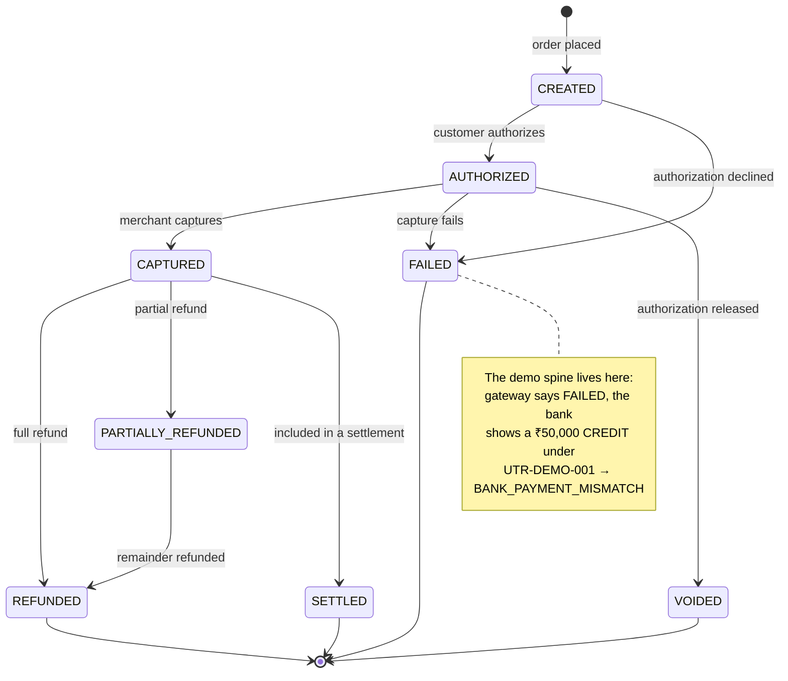

---

## 10. Data Model

All monetary columns are `BIGINT` paise. `merchant_id` is denormalized onto the hot tables so every query and every AI tool can be tenant-scoped with a single predicate.

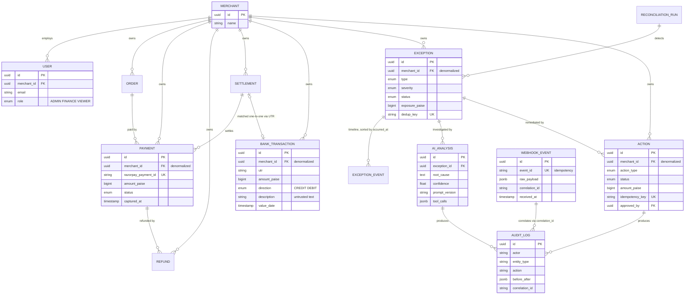

---

## 11. Frontend Design Flow

Seven routes. The operator's path through them is a funnel: notice → triage → understand → act. The dashboard's only job is to make the next click obvious.

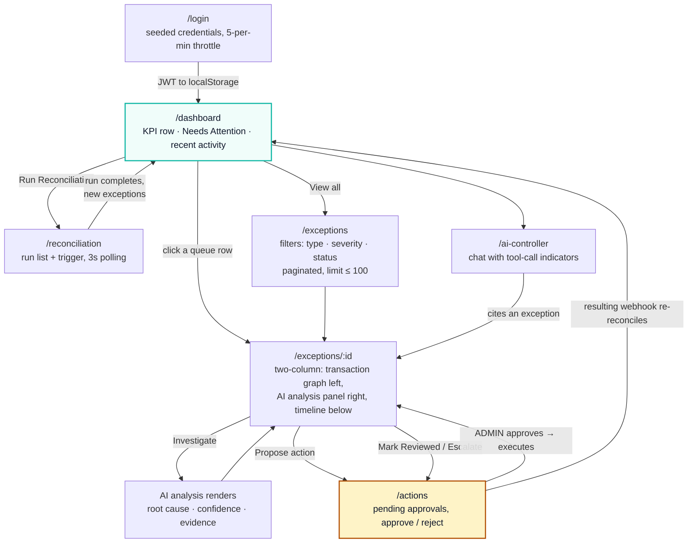

### State handling every page owes you

Per [12-ERROR-HANDLING.md](12-ERROR-HANDLING.md) §5, each data surface needs four states, not one:

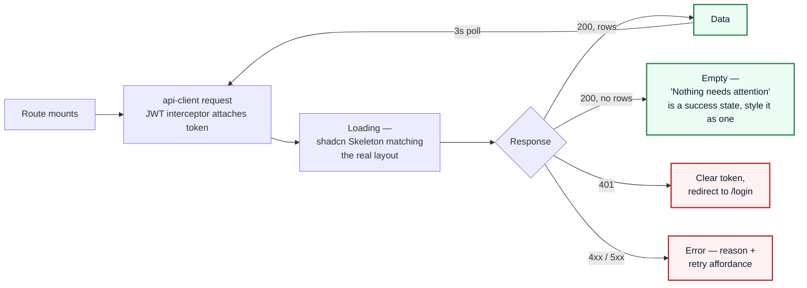

---

## 12. Design System Reference

**"Refined Fintech Minimalism"** — a dense, quiet interface where colour is reserved for severity and nothing else. If everything is emphasized, the ₹50,000 exception looks the same as the ₹12 one.

| Token | Hex | Used for |
| --- | --- | --- |
| Background | `#F8FAFC` | App canvas |
| Surface | `#FFFFFF` | Cards, table surfaces, drawer |
| Primary accent | `#14B8A6` | Brand teal — primary actions, active nav, focus rings |
| Text primary | `#0F172A` | Headings, figures |
| Text secondary | `#475569` | Labels, metadata, table headers |
| Critical | `#B91C1C` | Critical severity, failures |
| Warning | `#B45309` | High severity, pending approval |
| Success | `#15803D` | Reconciled, completed, resolved |
| Info | `#1D4ED8` | Informational badges, in-progress runs |

> **Brand note:** the accent is **teal `#14B8A6`**, confirmed against the logo (padlock circle split into teal ledger bars and a blue circuit-brain, green check, wordmark "Ledger" in silver and "Mind" in teal on dark navy). Earlier drafts of the frontend README used `#1D4ED8` as the primary accent — that value is stale and demoted to an info colour here. The logo currently exists only as a dark-background raster lockup, so it cannot sit directly on the `#F8FAFC` canvas; use it in the dark sidebar or on a navy plate until a light-mode variant exists.

**Typography** — Inter or Manrope. Every numeric column uses `tabular-nums` so digits align vertically; misaligned money columns are unreadable at a glance.

**Layout** — persistent left sidebar plus topbar, dense tables with status badges, and a two-column detail view (graph left, AI panel right). Components come from shadcn/ui: `Card`, `Table`, `Badge`, `Button`, `Dialog`, `Input`, `DropdownMenu`, `Progress`, `Skeleton`. Charts are Recharts — an area chart for reconciliation rate over time, a bar chart for exception types by volume.

**Money formatting** — one shared utility, everywhere, no exceptions:

```ts
// lib/money.ts — the only place paise become rupees
export function formatPaise(paise: string): string {
  const n = BigInt(paise);
  const sign = n < 0n ? "-" : "";
  const abs = n < 0n ? -n : n;
  const rupees = abs / 100n;
  const fraction = abs % 100n;
  return `${sign}₹${rupees.toLocaleString("en-IN")}.${fraction.toString().padStart(2, "0")}`;
}
```
